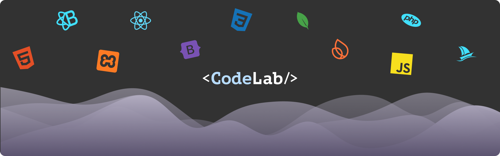

<a id="readme-top"></a>

# CodeLab “Experiment. Learn. Code.”

[](https://github.com/JoshuaDeKlerk/CodeLab/graphs/contributors)
[](https://github.com/JoshuaDeKlerk/CodeLab/network/members)
[](https://github.com/JoshuaDeKlerk/CodeLab/stargazers)
[](https://github.com/JoshuaDeKlerk/CodeLab/issues)
[](https://creativecommons.org/licenses/by-nc/4.0/)
[](https://codelab-b198b.web.app/)


---

## Table of Contents

- [About CodeLab](#about-codelab)
- [Built With](#built-with)
- [Installation](#installation)
- [Features](#features)
- [AI Integration](#ai-integration)
- [The Idea](#the-idea)
- [Development Process](#development-process)
- [Future Implementations](#future-implementations)
- [Mockups](#mockups)
- [License](#license)
- [Contributing](#contributing)
- [Authors](#authors)
- [Contact](#contact)
- [Acknowledgements](#acknowledgements)

<p align="right"><a href="#readme-top">[⬆️ Back to top]</a></p>

---

# About CodeLab

**CodeLab** is an **AI-powered coding education app** that helps beginners learn programming through creating a journey specifically for someones need by the use of ai.

It bridges the gap between learning and doing offering an adaptive, gamified environment where users can:
- Make their own coding learning journey
- Get simplified lessons on complex problems

**Target Audience:**  
High school students, self-taught beginners, and early CS learners.

**Domain:**  
Education Technology

---

## Built With

<p align="left">         </p>

---


## How To Install CodeLab

###
- **Node.js 20+** and **npm 10+**  
- **Git**  
- **Firebase CLI** → `npm i -g firebase-tools`  
- A Google account with access to your Firebase project 


### Step 1: Clone the Repository

```bash
git clone https://github.com/JoshuaDeKlerk/CodeLab
cd CodeLab
```

### Step 2: Install Dependencies

```bash
npm install
```

### Step 3: Environment Setup (Frontend)

Create a file named `.env.local` in the project root.
Use the same Firebase credentials from your project settings.

**Do not commit `.env.local` — it should be ignored in .gitignore.**:

**Template**
```env
VITE_FIREBASE_API_KEY=YOUR_API_KEY
VITE_FIREBASE_AUTH_DOMAIN=YOUR_PROJECT.DOMAIN
VITE_FIREBASE_PROJECT_ID=YOUR_PROJECT_ID
VITE_FIREBASE_STORAGE_BUCKET=YOUR_BUCKET
VITE_FIREBASE_MESSAGING_SENDER_ID=YOUR_SENDER_ID
VITE_FIREBASE_APP_ID=YOUR_APP_ID
VITE_FIREBASE_MEASUREMENT_ID=YOUR_MEASUREMENT_ID
```
### Step 4: Firebase Project Setup

Log in and connect your project:

```bash
firebase login
firebase use YOUR_FIREBASE_PROJECT
```

Ensure the following APIs are enabled in your **Google Cloud Console:**
- Cloud Functions API
- Cloud Build API
- Artifact Registry API
- Generative Language / Vertex AI API (for Gemini)


### Step 5: Running Locally

```bash
npx expo start
```

Your local server should start at:

```
http://localhost:5173
```

### Step 6: Deploy Cloud Functions

From your project root (or `/functions` folder if split):

```bash
npx expo start
```

The default region for your functions is `europe-west1`, ensure consistency for all deployed functions.

### Step 7: Configure Storage CORS

If fetching files (JSON, assets) directly from Firebase Storage:

Create a file named `cors.json`:

```json
[
  {
    "origin": ["http://localhost:5173", "https://<your-prod-domain>"],
    "method": ["GET", "HEAD", "OPTIONS"],
    "responseHeader": ["Content-Type", "x-goog-meta-*"],
    "maxAgeSeconds": 3600
  }
]
```

Then apply it:

```bash
gsutil cors set cors.json gs://codelab-b198b.firebasestorage.app
```
## Step 9 – Troubleshooting Quick Checks

Use this checklist if something goes wrong while running or deploying **CodeLab**.

---

### Common Issues & Fixes

| Problem | Possible Cause | Solution |
|----------|----------------|-----------|
| **Blank page / Auth not working** | Incorrect Firebase config values | Ensure all keys in `.env.local` exactly match the values from your Firebase project settings. Restart the dev server after editing `.env.local`. |
| **CORS error on Firebase Storage** | Missing or outdated CORS rules | Re-apply your CORS settings with: <br>`gsutil cors set cors.json gs://YOUR_FIREBASE_APP.firebasestorage.app` <br>Make sure the `origin` field includes both `http://localhost:5173` and your production domain. |
| **Functions deploy timeout** | Cloud APIs disabled or cold-start delay | Verify that these APIs are enabled in Google Cloud Console: <br>• Cloud Functions API  • Cloud Build API  • Artifact Registry API. <br>Then redeploy using `firebase deploy --only functions`. |
| **403 / Permission error on Gemini API** | Project lacks Vertex AI / Gemini access or missing service-account role | In Google Cloud Console, enable the **Generative Language API (Gemini)** and ensure your service account has at least `roles/aiplatform.user`. Redeploy your functions afterwards. |
| **Realtime data not updating** | Firestore rules or emulator mismatch | If testing locally, confirm you’re using the Emulator Suite and your client SDK points to `localhost`. For production, review Firestore security rules and indexes. |
| **Storage uploads failing** | Authenticated user lacks write permission | Check your Firebase Storage security rules. For public reads but restricted writes, use: <br>```json<br>allow read: if true; <br>allow write: if request.auth != null;``` |


<p align="right"><a href="#readme-top">[⬆️ Back to top]</a></p>
---


## Adding Your Gemini API Key as a Secret

Never hard-code your Gemini API key in functions or version control.  
Store it securely using Firebase Functions Secrets.

### Set the secret via Firebase CLI
Run this in your project root:
```bash
firebase functions:secrets:set GEMINI_API_KEY
```

You’ll be prompted to paste your Gemini API key.

The key is encrypted and stored securely in Google Secret Manager.

### Access the secret inside Cloud Functions
In your `index.js`:
```js
const { defineSecret } = require("firebase-functions/params");
const { onCall, HttpsError } = require("firebase-functions/v2/https");
const GEMINI_API_KEY = defineSecret("GEMINI_API_KEY");

exports.generateModule = onCall(
  { secrets: [GEMINI_API_KEY] },
  async (req) => {
    const apiKey = GEMINI_API_KEY.value();
    // use apiKey to call Gemini API
  }
);
```

When deployed, Firebase Functions automatically injects the secret value into the runtime environment—no `.env` file required.

### Verify the secret in Google Cloud Console
1. Go to `Google Cloud Console` → `Security` → `Secret Manager`
2. Locate `GEMINI_API_KEY`
3. Confirm your Firebase Functions service account has `Secret Accessor` permission.

### Deploy your Functions with Secrets
In your `index.js`:
```bash
firebase deploy --only functions
```

When deployed, Firebase Functions automatically injects the secret value into the runtime environment—no `.env` file required.

---

## Extra Tips
- Restart Vite dev server after any `.env` or CORS changes.  
- Clear browser cache or run an incognito window to remove cached tokens.  
- Check the **Functions logs** in the Firebase Console (`Functions → Logs`) for detailed error messages.  
- Use `firebase emulators:start` to debug locally before deploying live.

<p align="right"><a href="#readme-top">[⬆️ Back to top]</a></p>
---

## ✨ Features

| Feature | Description |
|---|---|
| **AI Journey Generator** | Creates a personalized learning journey (worlds → lessons → modules) from a short prompt using **Firebase Functions** + **Gemini**. |
| **World Map & Lessons** | Visual world map of your track with unlockable lessons and clearly scoped learning outcomes. |
| **Auth & Profiles** | Firebase Auth (email/password, Google) with per-user progress stored securely. |
| **Cloud Content** | Lesson metadata and generated modules are stored in Firestore / Storage and fetched on demand. |
| **Modular Content Model** | JSON-driven “World → Lesson → Module → Blocks” structure for easy seeding and iteration. |
| **Stateful Module Reader** | Clear states for *idle / loading / generating / ready / error*, with actionable recovery hints. |
| **Secure AI Calls** | Gemini API key managed via **Functions Secrets**; no keys in the client or repo. |
| **Developer Tooling** | Vite + React dev server, Firebase Emulators (Auth/Firestore/Functions), and CORS presets for Storage. |

### What a typical flow looks like

1. **Start a Journey** → The user enters a coding topic or goal (e.g., “Learn JavaScript basics”). A **Firebase Cloud Function** calls **Gemini**, which generates a fully structured journey consisting of interconnected **worlds**, **lessons**, and **modules** tailored to the user’s level.
2. **Choose a World** → From the dynamic world map, the user selects a themed world that represents a programming domain (e.g., Front-End Foundations, Python Basics). Each world contains a series of progressive lessons.
3. **Choose a Lesson** → Within a world, the user picks a specific lesson to explore. The app retrieves JSON-based lesson data including objectives, content blocks, and challenges  directly from **Firestore** or **Firebase Storage**.
4. **Open a Module** → Each lesson is broken into smaller, hands on modules. The **Module Reader** loads the relevant blocks such as text, code examples, and test cases. The interface updates in real time as the user progresses.
5. **Learn** → The user learns to code from a beginner level


<p align="right"><a href="#readme-top">[⬆️ Back to top]</a></p>

---
## The Idea

**CodeLab’s mission** is to make learning code accessible, personalized, and motivating for beginners.  
Instead of following static tutorials, users create their own **AI-generated learning journeys** that adapt to their goals, skill levels, and preferred coding languages.

By combining **AI guidance** with **interactive exercises**, CodeLab transforms the typical coding education experience into a structured, game-like progression.  
Learners can explore visual “worlds,” complete hands-on lessons, and receive **real-time feedback** from **Gemini**, helping them understand both *what went wrong* and *why*.

The platform aims to lower the barrier to entry for coding education by offering:
- Immediate feedback instead of waiting for a mentor.  
- Personalized learning paths generated dynamically by AI.  
- A sense of progress through XP, streaks, and unlockable worlds.

CodeLab isn’t just another tutorial site it’s an evolving, intelligent environment where anyone can **experiment, learn, and code**.

---

## Usability Testing & Peer Reviews

**When:** Week 15  
**Who:** 3 peers (Enzo De Vittorio, Jaco Mostert, Zander Bezuidenhout)  
**Goal:** Validate the MVP’s clarity, navigation, speed, visual design, and AI usefulness; capture action items before final submission.

### Method
- **Tasks:** Start a journey → choose a world → open a lesson → open a module → run tests → request AI help.
- **Instrument:** Short Likert (1–5) form + open-ended questions.
- **Context:** Desktop (Chrome), project dev build.

### Key Scores (avg, n=3)
| Criterion | Avg |
|---|---:|
| Understanding what CodeLab does | **5.00** |
| Layout & navigation | **5.00** |
| Visual design | **5.00** |
| Speed & responsiveness | **4.33** |
| Overall enjoyment | **4.67** |

**Would recommend CodeLab?** 3 / 3 said **Yes** 

### Notable Comments (selected)
- “After creating your journey the page is at first **very clutter[ed]**… but not too bad.”
- “**Rendering takes a while**… took long for AI to generate the journey.”
- “A little confusing when the world is made in the **Your Learning Journey** section.”
- Feature requests: **Level system** (XP/levels), **image generation/visuals** for lessons.

### Findings
- **Clarity:** Excellent initial understanding of purpose (5.0).
- **Navigation:** Intuitive world → lesson → module flow (5.0).
- **Design:** Colors/typography/readability well received (5.0).
- **Performance:** Perceived latency during journey generation and first render (4.33).
- **Information density:** Post-generation screen feels **busy**; needs hierarchy/declutter.
- **Onboarding:** Some confusion around the “Your Learning Journey” area post-generation.

### Changes Before Final Submission
1. **Reduce clutter after generation**
   - Add a **success panel** with 2 clear CTAs: “View World Map” and “Go to First Lesson”.
   - Collapse secondary panels by default; add “Expand details” toggles.

2. **Speed & Perceived Performance**
   - Show a persistent **progress indicator** with clear stages (Generating → Validating → Saving).
   - Preload the first world/lesson metadata and defer heavy assets (lazy fetch JSON blobs).

3. **World/Lesson Onboarding**
   - Add a short **guided tooltip** (3 steps) explaining “Worlds → Lessons → Modules”.
   - Rename/clarify “Your Learning Journey” heading; add a one-line descriptor.

4. **Level/XP surfacing**
   - Add **XP + Level badge** to header; toast on completion; basic leveling table in profile.

5. **AI Helper affordance**
   - Pin “**Ask AI**” button in module header with fixed modes: *Hint*, *Explain*, *Why failed*.

### Next Iteration (Nice-to-Have)
- Optional **image/diagram generation** for concept cards (low priority).
- Add **skeleton loading** for world/lesson cards to smooth perceived latency.

---

## Development Process

### Architecture at a Glance
- **Frontend:** Vite + React (React Router), modular UI for World → Lesson → Module flows.
- **Backend:** Firebase **Cloud Functions (v2, europe-west1)** for secure AI calls to **Gemini**.
- **Data:** Firestore for user/journey metadata; Firebase Storage for large JSON module blobs.
- **Auth:** Firebase Auth (per-user reads/writes, creator-only admin paths).
- **Ops:** Google Cloud Console for APIs/roles; Secrets Manager for `GEMINI_API_KEY`.

---

### Highlights
- **AI Content Pipeline**
  - Deterministic prompt templates that generate **Worlds → Lessons → Modules**.
  - Function validates Gemini output against a strict **JSON schema** and writes to
    `journeys/{uid}/default/.../*.json` (Storage) + metadata (Firestore).
- **Modular Content Model**
  - Versioned schema: `World > Lesson > Module > Blocks (text, code, tests, hints)`.
  - Easy to seed/update without shipping a new build.
- **Stateful Module Reader**
  - Explicit states: `idle → loading → generating → ready → error`.
  - Retry with backoff & actionable hints (e.g., “re-generate module”).
- **Secure by Default**
  - **Secrets:** Gemini key via `functions:secrets:set` (never in client).
  - **Rules:** Per-user reads for `journeys/{uid}/**`, no client writes; Admin SDK only.
  - **CORS:** Bucket configured for localhost + prod to enable direct `?alt=media` fetches.
- **Dev Experience**
  - Firebase Emulator Suite for Auth/Firestore/Functions.
  - One-command deploys (`--only functions`) and environment parity via `.env.local`.
  - Structured logs and error surfaces in UI & Functions logs.

---

### Implementation Phases
1. **Planning & IA** → Define learner personas, learning goals, and world/lesson/module taxonomy.
2. **Data Modeling** → Design Firestore documents and Storage paths; write JSON schemas.
3. **Prompt Engineering** → Create Gemini system prompts; add guardrails & few-shot examples.
4. **Functions** → Implement `generateJourney` / `generateModule`; validate, sanitize, persist.
5. **Frontend** → Build World Map, Lesson list, Module Reader, Progress dashboard.
6. **Testing** → Emulator-based smoke tests; schema validation tests; UI error states.
7. **Usability & Polish** → Empty states, loading skeletons, re-gen flows, progress feedback.
8. **Deployment** → Enable required APIs, set secrets, deploy Functions & hosting.

---

### Challenges & Solutions
- **Function cold starts & timeouts**
  - Set `region`, `memory`, `timeoutSeconds`; trim dependencies; pre-validate inputs to avoid wasted calls.
- **CORS on Storage**
  - Applied `gsutil cors set` with localhost + prod origins; ensured `?alt=media` fetch patterns.
- **Unreliable AI JSON**
  - Enforced JSON schema; on parse/shape error → call Gemini with a “repair” prompt; clear error surfaced to UI.
- **Idempotency & Race Conditions**
  - Deterministic IDs and “upsert” semantics; write metadata only after Storage write succeeds.
- **Quota/Cost Control**
  - Token-bounded prompts, concise outputs, and caching of generated journeys per user.
- **Safety & Prompt Injection**
  - Strict system prompts, content filters, and no tool/secret echoes back to the client.

---

### Tooling & Scripts
- `npm run dev` – Vite dev server
- `firebase emulators:start` – Local Auth/Firestore/Functions
- `firebase deploy --only functions` – Functions deploy
- `scripts/validate-modules` – Optional: schema check for module JSON

<p align="right"><a href="#readme-top">⬆️ Back to top</a></p>

---

## 🔮 Future Implementations

- **Adaptive Learning Paths** — Dynamically reorder lessons/modules based on performance, time-on-task, and hint usage.
- **Exercise Tracks** — Curated, multi-week tracks (e.g., “JS Foundations”, “React Basics”, “Algorithms I”) with prerequisites and recommended pacing.
- **Submissions System** — Versioned code submissions, diff viewer, retry limits, late penalties (for classes), and plagiarism/similarity checks.
- **AI Helpbot** — Context-aware chat assistant (Gemini) that can reference the current module, your past attempts, and test failures; modes: *hint*, *explain like I’m 12*, *debug*, *concept recap*.
- **XP & Leveling Economy** — XP per task, combo streaks, bonus XP for first-pass success, levels that unlock themed worlds, and seasonal leaderboards.
- **Skill Analytics** — Mastery estimates per topic, error heatmaps, time-to-pass metrics, and recommendations for targeted practice.
- **Richer Exercise Runner** — Sandboxed execution with stdin/stdout capture, snapshot diffs, property-based tests, and performance constraints.
- **Instructor Mode & Classrooms** — Cohorts, assignments, rubrics, due dates, TA review queue, and CSV/Google Classroom import.
- **Content Studio** — Visual builder for Worlds → Lessons → Modules; schema validation, previews, and one-click publish/versioning.
- **Multi-Language Tracks** — Python, TypeScript, C# with language-specific stubs, linters, and graders.
- **Localization** — i18n for UI + lesson content; RTL support and region-specific examples.
- **PWA & Mobile Companion** — Installable PWA, offline reading, spaced-repetition flashcards, and push reminders.
- **Safety & Compliance** — POPIA/GDPR-aligned data retention, audit logs, role-based access, and model output moderation.
- **Collaboration** — Pair-coding with shared cursors, inline mentor comments, and code review suggestions.
- **Import/Export** — JSON/MDX export of lessons; Git-backed content repos for version control.
- **Quotas & Cost Controls** — Per-user AI budgets, caching strategies, and tiered usage for classrooms.
- **A/B Testing** — Experiment framework for prompts, hint styles, and UI variants to improve learning outcomes.

<p align="right"><a href="#readme-top">[⬆️ Back to top]</a></p>

---

## 🧩 Usage

After launching **CodeLab**, users can:

- **Sign In or Create an Account**  
  Users authenticate securely with Firebase (email/password or Google). Each user’s progress, XP, and generated journeys are stored privately in Firestore.

- **Start a Journey**  
  Enter a coding topic or goal (e.g., “Learn JavaScript loops”). A Firebase Cloud Function calls **Gemini**, which generates a full personalized journey of *worlds, lessons, and modules*.

- **Explore the World Map**  
  Navigate through interactive worlds that visualize progress and unlocked lessons. Each world represents a skill area (e.g., HTML Foundations, Python Basics, or React Essentials).

- **Choose a Lesson**  
  Open a structured lesson that breaks a concept into smaller, interactive modules with theory, code tasks, and examples.

- **Open a Module**  
  The **Module Reader** loads JSON-based instructions, exercises, and test cases. Users can code directly in the built-in editor and view their results instantly.

<p align="right"><a href="#readme-top">[⬆️ Back to top]</a></p>

---

## Mockups

Below are UI mockups that guided the design and development of **CodeLab**.  
Each screen demonstrates a different stage in the learning journey — from signing up to exploring AI-generated worlds and completing interactive coding modules.

---

### Landing Page
  
The entry point of **CodeLab**, introducing the platform’s concept — “Experiment. Learn. Code.”  
Features call-to-action buttons for “Start Learning” and “Login,” along with a short overview of the AI-driven experience.

---

### Login Page
  
A minimal and focused sign-in page powered by **Firebase Authentication**.  
Supports both **email/password** and **Google sign-in** options for quick access.

---

### Sign-Up Page
  
Clean registration screen where new users create accounts, linked directly to their **Firestore profiles**.  
Includes validation, responsive layout, and branded colors that match the app’s visual identity.

---

### World Map Page
  
An interactive overview of the user’s AI-generated learning journey.  
Each “world” represents a skill area (e.g., Front-End Basics, Python Logic) that unlocks as the user earns XP and progresses through lessons.

---

### Lessons Page
  
Displays all lessons within a selected world.  
Each lesson card includes a brief description, estimated difficulty, completion status, and access to the next available module.

---

### Module Page
  
The core of **CodeLab** where learning happens.  
Contains step-by-step instructions, a built-in code editor, test runner, and **Gemini-powered AI mentor** that gives hints, explanations, and debugging feedback in real time.

---

### 404 Page (Not Found)
  
A friendly and minimal error page that appears when users navigate to a non-existent route or an expired module link.  
Features a clear message (“Oops! This page doesn’t exist.”), a themed **CodeLab illustration**, and a **“Return to World Map”** button to guide users back into their learning journey.

The 404 design keeps the same visual language and dark aesthetic as the rest of CodeLab, ensuring a consistent user experience even during navigation errors.

---

<p align="right"><a href="#readme-top">[⬆️ Back to top]</a></p>


## Other Resources

### Development & Documentation

- [Live Site](https://codelab-b198b.web.app/) – Visit our live site
- [Frontend Repository](https://github.com/JoshuaDeKlerk/CodeLab) – Main Vite + React web app connected to Firebase.
- [Firebase Console](https://console.firebase.google.com/) – Manage Authentication, Firestore, Storage, and Functions.
- [Google Cloud Console](https://console.cloud.google.com/) – Configure APIs, IAM permissions, and manage Gemini access.
- [Gemini API Reference](https://ai.google.dev/) – Official Gemini documentation for model parameters, prompt examples, and quota limits.
- [Firebase Functions Documentation](https://firebase.google.com/docs/functions) – Guides for deploying and managing serverless functions.
- [Firestore Data Modeling Guide](https://firebase.google.com/docs/firestore/data-model) – Learn best practices for structuring nested data and subcollections.
- [Vite Documentation](https://vitejs.dev/guide/) – Fast build tool and dev server used for CodeLab’s frontend.
- [React Documentation](https://react.dev/) – Core framework for building interactive UI and stateful components.
- [Tailwind CSS](https://tailwindcss.com/docs/installation) – (Optional) for styling reusable components with utility classes.

---

### Assets & Design Tools

- [Figma](https://www.figma.com/) – Used for wireframes, prototypes, and the CodeLab UI system.
- [Unsplash](https://unsplash.com/) & [Pexels](https://pexels.com/) – Free stock images for banners and visual content.
- [Mockuuups Studio](https://mockuuups.studio/) – Create device mockups for presentation materials.
- [Dribbble](https://dribbble.com/) & [Behance](https://behance.net/) – Design inspiration sources for educational dashboards.

---

### Environment Variable Template

When setting up the project locally, include the following in your `.env.local`:

```bash
VITE_FIREBASE_API_KEY=your_api_key
VITE_FIREBASE_AUTH_DOMAIN=your_project.firebaseapp.com
VITE_FIREBASE_PROJECT_ID=your_project_id
VITE_FIREBASE_STORAGE_BUCKET=your_project.firebasestorage.app
VITE_FIREBASE_MESSAGING_SENDER_ID=your_sender_id
VITE_FIREBASE_APP_ID=your_app_id
VITE_FIREBASE_MEASUREMENT_ID=your_measurement_id
```

## License

**CodeLab** © 2025 by **Joshua De Klerk** is licensed under the  
**Creative Commons Attribution-NonCommercial 4.0 International (CC BY-NC 4.0)** License.

This means:
- You may share, copy, and adapt the material for personal or educational use.
- You may **not** use this project, its source code, or any derivative works for commercial purposes or profit.
- You must give appropriate credit, provide a link to this license, and indicate if changes were made.

View the full license details here:  
[Creative Commons BY-NC 4.0](https://creativecommons.org/licenses/by-nc/4.0/)

---

## Contributing

Contributions are welcome! If you'd like to help improve **CodeLab**, follow these steps:

1. Fork the repo
2. Create a new branch (`git checkout -b feature/NewFeature`)
3. Commit your changes (`git commit -m 'Add new feature'`)
4. Push to the branch (`git push origin feature/NewFeature`)
5. Open a pull request

**Note:** By contributing, you agree that all submitted code will also be covered under the same **CC BY-NC 4.0** license and cannot be used for commercial purposes.

<p align="right"><a href="#readme-top">[⬆️ Back to top]</a></p>

## Author

<a href="https://github.com/JoshuaDeKlerk">
  
  <br/>
  <sub><b>Joshua De Klerk</b></sub>
</a>

**Developer | Designer | AI Enthusiast**

**Open Window Institute** — Interactive Development  
South Africa  

Joshua is a creative developer passionate about building AI-driven educational tools that empower learners to explore coding through experimentation and curiosity.  
CodeLab is part of his final DV300 project at **Open Window**, showcasing the potential of generative AI in personalized education.

---

## Contact

For any questions, collaboration opportunities, or portfolio inquiries:

- **Email:** [joshuadeklerk04@gmail.com](mailto:joshuadeklerk04@gmail.com)  
- **Linktree:** [https://linktr.ee/JoshuaDeKlerk](https://linktr.ee/JoshuaDeKlerk)  
- **GitHub:** [JoshuaDeKlerk](https://github.com/JoshuaDeKlerk)

---

<p align="right"><a href="#readme-top">[⬆️ Back to top]</a></p>

## Report Issues

Found a bug or want to suggest a new feature for **CodeLab**?  
Your feedback helps improve the experience for everyone!  

- [Request a Feature or Report a Bug](https://github.com/JoshuaDeKlerk/CodeLab/issues/new)  
- Please include clear steps to reproduce the issue, screenshots (if relevant), and your environment details (browser, OS, etc.).  
- Feature suggestions that enhance AI learning or interactivity are especially welcome!

---

## Acknowledgements

- **[Armand Pretorius](https://github.com/Armand-OW)** – Lecturer and project supervisor, Open Window, School of Creative Technologies.  
- [Stack Overflow](https://stackoverflow.com/) – For development troubleshooting and community-driven solutions.  
- [Figma](https://www.figma.com/) – Used for interface design, wireframing, and prototyping the CodeLab UI.  
- [Firebase](https://firebase.google.com/) – For Authentication, Firestore, Storage, and Cloud Functions integration.  
- [Gemini API (Google AI)](https://ai.google.dev/) – Powers AI-driven lesson generation and contextual coding feedback.  
- [Google Cloud Console](https://console.cloud.google.com/) – For managing APIs, permissions, and secret configurations.  
- [Vite](https://vitejs.dev/) – Lightning-fast dev environment powering the frontend.  
- [React](https://react.dev/) – Core framework for building the user interface and dynamic content rendering.  
- [Lucide Icons](https://lucide.dev/) – Clean, consistent iconography across the app.  
- [Unsplash](https://unsplash.com/) & [Pexels](https://pexels.com/) – Free-to-use photography for visual design assets.  
- [Mockuuups Studio](https://mockuuups.studio/) – For generating realistic mockups for presentation and documentation.  

---

<p align="right"><a href="#readme-top">[⬆️ Back to top]</a></p>


